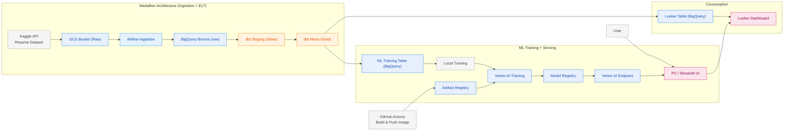

# VertexOps Pipeline

## Overview
End-to-end data + ML pipeline using **Airflow**, **dbt**, **BigQuery**, **Vertex AI**, and **Looker**.

---

## Architecture — Data + MLOps (End-to-End)



### Medallion Layers
- **Bronze (raw)**: `raw_resume_screening`
- **Silver (staging)**: `stg_resume_screening`
- **Gold (marts)**: `mart_resume_features`

---

## CI/CD — GitHub Actions
- Build & push training image to Artifact Registry.
- Workflow: `.github/workflows/build-training-image.yml`

Reproducible setup (run once):
```powershell
pwsh scripts/bootstrap_mlops_ci_cd.ps1 -ProjectId vertexops-pipeline
```

Image URI (example):
```
europe-west1-docker.pkg.dev/vertexops-pipeline/ml-training/resume-ml-trainer:latest
```

Required GitHub secrets:
- `GCP_WIF_PROVIDER`
- `GCP_SERVICE_ACCOUNT`

---

## Orchestration — Airflow
Pipeline:
```
ingest → dbt build → vertexai train/deploy
```

The training task uses the pre-built image from Artifact Registry.

---

## Training + Deployment — Vertex AI
`ml/training/vertex_launcher.py`:
- launches a Custom Container training job
- uploads model to Model Registry
- deploys the model to an endpoint

**Promotion rule:** deploy only if the new model is better (F1).

---

## Streamlit Demo (coming)
Run the app to test predictions:

```powershell
uv sync
uv run streamlit run app/streamlit_app.py
```

Set environment variables (optional):
```
PROJECT_ID=vertexops-pipeline
REGION=europe-west1
VERTEX_ENDPOINT_ID=<your-endpoint-id>
```

---

## Diagram as interactive image
You can render Mermaid diagrams into images with:
- [Mermaid Live Editor](https://mermaid.live/)
- VS Code extension: **Mermaid Preview**

---

If you need WIF setup commands or the promotion logic, ask and I’ll provide them.